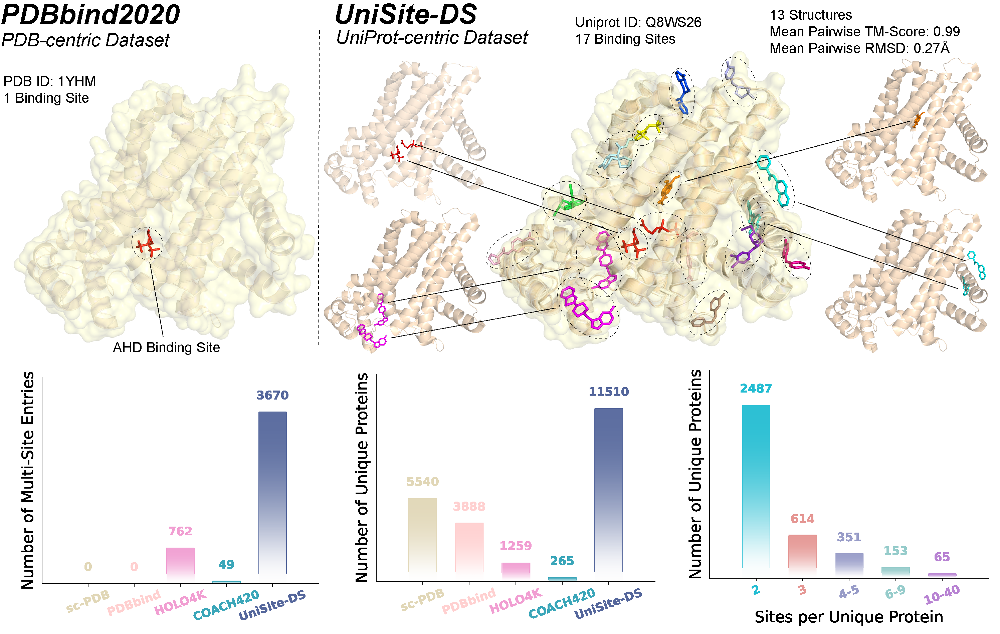
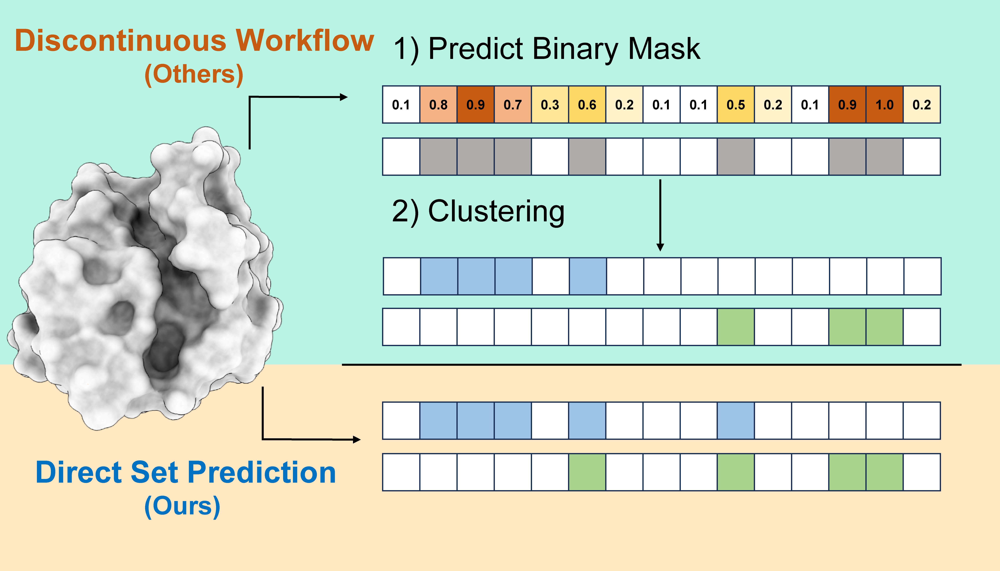
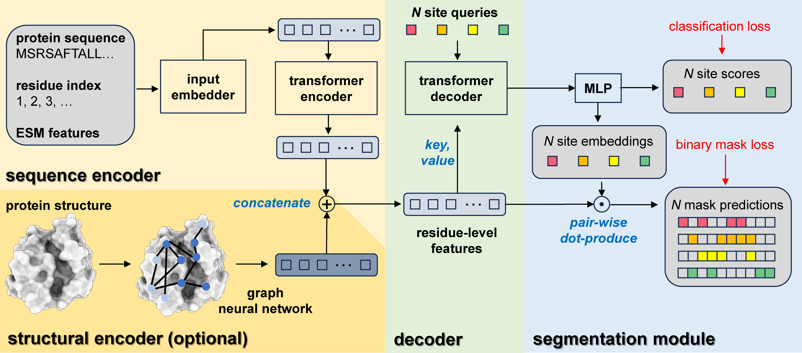
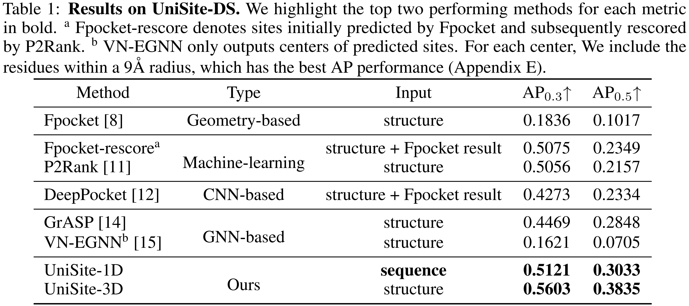

# UniSite: UniProt-centric Dataset and Learning Framework for Protein Ligand Binding Site Detection

The official implementation for "UniSite: The First Cross-Structure Dataset and Learning Framework for End-to-End Ligand Binding Site Detection".

The detection of ligand binding sites for proteins is a fundamental step in Structure-Based Drug Design. Despite notable advances in recent years, existing methods, datasets, and evaluation metrics are confronted with several key challenges:

1. current datasets and methods are centered on individual protein–ligand complexes and neglect that diverse binding sites may exist across multiple complexes of the same protein, introducing significant statistical bias;
2. ligand binding site detection is typically modeled as a discontinuous workflow, employing binary segmentation and subsequent clustering algorithms;
3. traditional evaluation metrics do not adequately reflect the actual performance of different binding site prediction methods.

To address these issues, we first introduce **UniSite-DS, the first UniProt (Unique Protein)-centric ligand binding site datase**t, which contains 4.81 times more multi-site data and 2.08 times more overall data compared to the previously most widely used datasets.



We then propose **UniSite, the first end-to-end ligand binding site detection framework** supervised by set prediction loss with bijective matching.



In addition, we introduce **Average Precision based on Intersection over Union (IoU)** as a more accurate evaluation metric for ligand binding site prediction. Extensive experiments on UniSite-DS and several representative benchmark datasets demonstrate that IoU-based Average Precision provides a more accurate reflection of prediction quality, and that UniSite outperforms current state-of-the-art methods in ligand binding site detection.



## Installation

We recommend to use **Anonconda** and **PIP** for environment management.

```bash
conda create -n unisite python=3.10.16
conda activate unisite

# install pytorch=2.2.0 according to your CUDA version
conda install pytorch==2.2.0 torchvision==0.17.0 torchaudio==2.2.0 pytorch-cuda=11.8 -c pytorch -c nvidia

# install torch_cluster and torch_scatter
# you can find the versions compatible with your torch and CUDA version at https://pytorch-geometric.com/whl/
pip install https://data.pyg.org/whl/torch-2.2.0%2Bcu118/torch_cluster-1.6.3%2Bpt22cu118-cp310-cp310-linux_x86_64.whl
pip install https://data.pyg.org/whl/torch-2.2.0%2Bcu118/torch_scatter-2.1.2%2Bpt22cu118-cp310-cp310-linux_x86_64.whl

# install other dependencies
pip install -r requirements.txt

# install unisite as a package
pip install -e .

mkdir -p model_weights
# download model weights
# you can download the weights manually from https://huggingface.co/quanlin-wu/unisite_protein-ligand_binding_site_detection_v1 or run the following commands
wget https://huggingface.co/quanlin-wu/unisite_protein-ligand_binding_site_detection_v1/resolve/main/uniste_1d_all.pth?download=true -O model_weights/unisite_1d_all.pth
wget https://huggingface.co/quanlin-wu/unisite_protein-ligand_binding_site_detection_v1/resolve/main/uniste_3d_all.pth?download=true -O model_weights/unisite_3d_all.pth

# download esm2 weights, it may take a while
mkdir -p model_weights/esm2
wget https://dl.fbaipublicfiles.com/fair-esm/models/esm2_t33_650M_UR50D.pt -O model_weights/esm2/esm2_t33_650M_UR50D.pt
wget https://dl.fbaipublicfiles.com/fair-esm/regression/esm2_t33_650M_UR50D-contact-regression.pt -O model_weights/esm2/esm2_t33_650M_UR50D-contact-regression.pt
```

## Inference

We provide a fast and easy-to-use inference script as `predict.sh`. Inference can be done as following:

```bash
bash predict.sh {INPUT_DATA} {OUTPUT_DIR}
(e.g. bash predict.sh test/3cifC.pdb test/3cifC_output)
```

{INPUT_DATA} is the path to the input data, which can be one of the following formats:

- A single PDB file.
- A directory containing PDB files.
- A FASTA file containing protein sequences.

When a FASTA file is provided, UniSite will switch to "seq_only" mode, which corresponds to the "UniSite-1D" model in the paper. In this mode, UniSite will predict the binding sites based on the protein sequences only. If structural files are provided, the "UniSite-3D" model will be used, which further integrates the 3D structures of the proteins.

***NOTE***: only **single-chain proteins** are supported for prediction currently. For structure-based prediction, the input must be a "cleaned" PDB file that contains only protein atoms of the same chain. Non-protein components such as water molecules, small ligands, and ions should be removed. We provide a reference preprocessing script. To use it, first install the required dependencies with `conda install -c conda-forge -c schrodinger pymol-bundle`, and then run the following command: `python unisite/data/clean_pdb.py --input {PDB file path / PDBs dir path} --output {cleaned PDB(s) dir path}`.

{OUTPUT_DIR} is the directory where the results will be saved. For each protein, UniSite will output a PKL file and a CSV file. The PKL file contains the raw predictions where binding sites are denoted by residue-level binary masks. The CSV file are more readable, an example of which is shown below:

```
score,center,residue_id,position_id
0.99977225,"[31.95596694835094, 93.86229873657246, 8.260954718844719]",8+9+10+11+12+13+14+33+34+35+36+37+78+79+97+98+99+101+121+122+152+153+183+184+319+320+323,7+8+9+10+11+12+13+32+33+34+35+36+77+78+96+97+98+100+120+121+151+152+182+183+318+319+322
0.9997444,"[39.92494783148093, 104.86508541990806, 2.9128566503257067]",152+153+154+155+178+180+183+213+214+215+216+237+319,151+152+153+154+177+179+182+212+213+214+215+236+318
```

The `score` column indicates the confidence score of the binding site prediction, while the `center` column indicates the center of the predicted binding site in 3D space. The `residue_id` and `position_id` columns indicate the residue IDs and the sequence positions of the predicted binding site residues, respectively. Predictions are sorted by the `score` column in descending order.

## Evaluation

```bash
# IoU-based AP
python unisite/evaluation/eval_ap.py -e {EVALUATION_DIR} -t {GROUND_TRUTH_DIR}

# DCC & DCA
python unisite/evaluation/eval_dcc_dca.py -e {EVALUATION_DIR} -t {TARGET_CSV}
```

## License

Licensed under the Apache License, Version 2.0 (the "License"); you may not use this code except in compliance with the License. You may obtain a copy of the License at https://www.apache.org/licenses/LICENSE-2.0.

Unless required by applicable law or agreed to in writing, software distributed under the License is distributed on an "AS IS" BASIS, WITHOUT WARRANTIES OR CONDITIONS OF ANY KIND, either express or implied, including, without limitation, any warranties or conditions of TITLE, NON-INFRINGEMENT, MERCHANTABILITY, or FITNESS FOR A PARTICULAR PURPOSE. See the License for the specific language governing permissions and limitations under the License.

Unless permission is granted, you are not allowed to use UniSite for any commercial purposes. If you would like to use UniSite for commercial purposes, you may contact: [JigangFan@stu.pku.edu.cn](mailto:JigangFan@stu.pku.edu.cn)。
